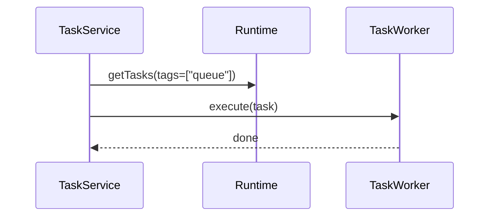
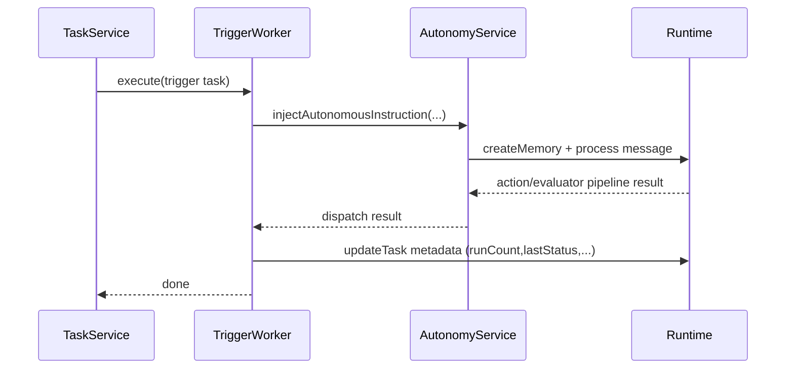

# Phase 1: Eliza Core Trigger Runtime

Phase 1 creates the execution substrate for triggers in Eliza core by reusing the existing Task engine while making trigger semantics explicit and verifiable.

---

## 1) Phase Goal

Deliver a runtime-safe trigger execution path that supports:

- interval triggers
- one-time scheduled triggers
- cron-like scheduled triggers
- autonomous-room instruction injection
- per-run status tracking

Without:

- breaking existing TaskService behavior
- requiring a second scheduler loop for v1

---

## 2) Non-Negotiable Constraints

1. Must use TaskService as execution engine for v1.
2. Must not assume `dueAt` controls scheduling unless TaskService is explicitly changed.
3. Must be safe when action-filtering and runtime action execution diverge.
4. Must tolerate autonomy service present/absent gracefully.
5. Must preserve one-off cleanup semantics and avoid zombie repeating tasks.

---

## 3) Trigger Data Model (Task Metadata Contract)

Use a namespaced metadata payload to avoid collisions with unrelated task metadata:

```ts
type TriggerType = "interval" | "once" | "cron";
type TriggerWakeMode = "inject_now" | "next_autonomy_cycle";
type TriggerExecutionStatus = "success" | "failed" | "skipped" | "deferred";

type TriggerConfig = {
  version: 1;
  triggerId: string;
  displayName: string;
  instructions: string;
  triggerType: TriggerType;
  enabled: boolean;
  wakeMode: TriggerWakeMode;
  createdBy: "user" | "agent" | "system";
  timezone?: string;
  intervalMs?: number;
  scheduledAtIso?: string;
  cronExpression?: string;
  maxRuns?: number;
  runCount: number;
  lastRunAtIso?: string;
  lastStatus?: TriggerExecutionStatus;
  lastError?: string;
};
```

Store as:

- `task.metadata.trigger = TriggerConfig`

Keep TaskService-required fields in the same metadata object:

- `metadata.updatedAt`
- `metadata.updateInterval`
- `metadata.blocking`

---

## 4) Scheduling Semantics Mapping to Current TaskService

Because TaskService schedules from `updatedAt + updateInterval` and tags:

### 4.1 Interval trigger

- tags: `["queue", "repeat", "trigger"]`
- `metadata.updateInterval = intervalMs`
- `metadata.updatedAt = Date.now()`
- optional immediate-first-run:
  - include `"immediate"` tag
  - set `metadata.createdAt` and `metadata.updatedAt` equal

### 4.2 Once trigger at future time

Use repeat semantics until first execution, then self-delete in worker:

- tags: `["queue", "repeat", "trigger", "trigger_once"]`
- `metadata.updateInterval = scheduledAt - now` (min bounded)
- worker deletes task on first successful/terminal run

Why this mapping:

- non-repeat tasks execute immediately in current TaskService;
- repeat mapping is the lowest-change way to schedule future one-off runs.

### 4.3 Cron trigger

- tags: `["queue", "repeat", "trigger", "trigger_cron"]`
- `metadata.updateInterval = nextRun - now`
- on each execution, worker computes next run and updates `metadata.updateInterval`

---

## 5) File-by-File Control Flow and Planned Changes

## 5.1 `eliza/packages/typescript/src/services/task.ts`

### Current flow

- Pulls all `"queue"` tasks each second.
- Validates by worker presence/validate callback.
- Applies due logic using `updatedAt` and `updateInterval`.
- Executes sequentially.

### Required changes

Minimal change path:

- no trigger-specific branch required for v1 scheduling
- optional deterministic sort for due tasks:
  - sort by computed due timestamp ascending, then id

Rationale:

- predictable ordering for simultaneous triggers reduces nondeterminism in autonomy context ingestion.

### Risk note

Avoid invasive changes in phase 1. Keep TaskService generic; encode trigger scheduling in metadata and worker behavior.

---

## 5.2 `eliza/packages/typescript/src/types/task.ts`

### Current flow

- `TaskMetadata` accepts arbitrary extension fields.

### Required changes

Add explicit typed optional field:

- `trigger?: TriggerConfig`

Optionally add dedicated exported types in a new file and reference from `TaskMetadata`.

Rationale:

- compile-time safety for trigger-related handlers and APIs;
- avoids stringly-typed metadata access throughout code.

---

## 5.3 `eliza/packages/typescript/src/runtime.ts`

### Current flow

- task CRUD pass-through to adapter;
- task worker map registration and retrieval.

### Required changes

No mandatory runtime logic changes for v1.

Optional enhancement:

- helper method for trigger worker registration to avoid duplicate-name overwrite mistakes (diagnostic only).

---

## 5.4 `eliza/packages/typescript/src/autonomy/service.ts`

### Current flow

- creates and executes autonomous thought task loop
- owns autonomous room and autonomy entity
- injects autonomous prompt as message memory

### Required changes

Expose a safe trigger-injection method with explicit semantics:

- `injectAutonomousInstruction(payload: { text: string; source: "trigger"; triggerId: string; triggerRunId: string; wakeMode: TriggerWakeMode; })`

Method behavior:

1. ensure autonomous room context exists
2. create message memory with trigger metadata
3. process through standard message pipeline
4. return run descriptor result

Why:

- centralizes trigger injection policy
- prevents each worker/action from hand-rolling autonomy memory format

---

## 5.5 New file: trigger worker

Candidate location options:

- `services/triggerWorker.ts`
- `advanced-capabilities/services/triggerWorker.ts`
- `bootstrap/services/triggerWorker.ts`

### Worker contract

`name = "TRIGGER_DISPATCH"`

`validate(...)`:

- confirm `task.metadata.trigger` exists
- confirm `trigger.enabled === true`
- confirm required schedule fields by type

`execute(...)`:

1. create `triggerRunId`
2. load trigger config from metadata
3. apply run gating (`maxRuns`, enabled)
4. dispatch instruction:
   - if autonomy service available: call `injectAutonomousInstruction(...)`
   - else: write failure/deferred status with explicit reason
5. update run state:
   - increment `runCount`
   - set `lastRunAtIso`, `lastStatus`, `lastError`
6. reschedule:
   - interval: no schedule mutation
   - once: delete task
   - cron: recompute next interval and update metadata

---

## 5.6 New file: trigger utilities

`trigger-scheduling.ts` helper functions:

- `computeInitialSchedule(...)`
- `computeNextCronDelayMs(...)`
- `isTriggerTask(task)`
- `normalizeTriggerTaskForCreate(...)`

This keeps task/action/api code paths consistent and reduces drift.

---

## 5.7 New file: trigger run log interface

If no durable table exists in phase 1, implement append-only structured runtime log records with stable shape:

```ts
type TriggerRunRecord = {
  triggerRunId: string;
  triggerId: string;
  taskId: string;
  startedAt: number;
  finishedAt?: number;
  status: TriggerExecutionStatus;
  error?: string;
  latencyMs?: number;
};
```

Storage options:

1. runtime logs (`runtime.log(...)` typed record)
2. memory table with type `trigger_run`

Phase 3 API can expose these records.

---

## 6) Detailed Step Plan (Implementation Sequence)

1. Add trigger types (`TriggerConfig`, run status enums).
2. Add trigger scheduling helpers and input validation.
3. Implement `TRIGGER_DISPATCH` worker.
4. Register worker in chosen capability stack.
5. Add autonomy service injection helper.
6. Add unit tests for each trigger type schedule semantics.
7. Add integration tests for worker + TaskService + autonomy injection.

---

## 7) Control Flow: Before vs After

## 7.1 Before



## 7.2 After (trigger path)



---

## 8) Failure Modes and Mitigations (Phase 1 Scope)

## 8.1 Worker missing

- Symptom: TaskService skips task forever.
- Mitigation:
  - register worker at startup before trigger creation paths open.
  - health check endpoint for worker registration state.

## 8.2 Disabled trigger still in queue

- Symptom: per-second validation overhead.
- Mitigation:
  - when disabling, remove `"queue"` tag instead of validate-only gating.

## 8.3 Trigger spam on repeated create

- Symptom: duplicate tasks with same instruction/schedule.
- Mitigation:
  - deterministic dedupe key in metadata
  - idempotent create semantics in API/action layer

## 8.4 Cron drift

- Symptom: next interval computed from execution end instead of schedule anchor.
- Mitigation:
  - compute next run from cron iterator anchored to current wall-clock in configured timezone.

## 8.5 Multi-process overlap

- Symptom: same trigger executed by two runtimes.
- Mitigation (phase 1.5):
  - add optimistic lease token in metadata before execution.
  - in multi-runtime deployments, migrate to adapter-level lock/claim strategy.

---

## 9) Phase 1 Alternatives (and Why Not Chosen as Default)

## Alternative A: Modify TaskService to honor `dueAt`

Pros:

- natural one-off scheduling semantics.

Cons:

- higher regression risk for all tasks;
- requires adapter and migration validation.

Decision:

- defer for later once trigger v1 is stable.

## Alternative B: New TriggerService scheduler loop

Pros:

- explicit trigger semantics, isolation from generic tasks.

Cons:

- duplicate scheduler complexity;
- larger operational surface area.

Decision:

- avoid in phase 1; revisit if trigger volume and policy complexity grows.

---

## 10) Acceptance Criteria for Phase 1

1. Interval trigger executes repeatedly at expected cadence.
2. Once trigger executes once at/after scheduled time and is removed.
3. Cron trigger executes and reschedules correctly across at least two cycles.
4. Trigger worker writes run status fields after each run.
5. Trigger instruction reaches autonomy message pipeline with stable metadata.
6. Disabled trigger produces no worker execution.
7. Existing non-trigger tasks continue unaffected.

---

## 11) Deliverables from Phase 1

- typed trigger metadata contract
- trigger scheduling helper module
- trigger worker implementation
- autonomy injection helper
- unit/integration tests for trigger runtime behavior

Phase 2 then layers action/capability registration and conversational creation on top of this runtime substrate.

